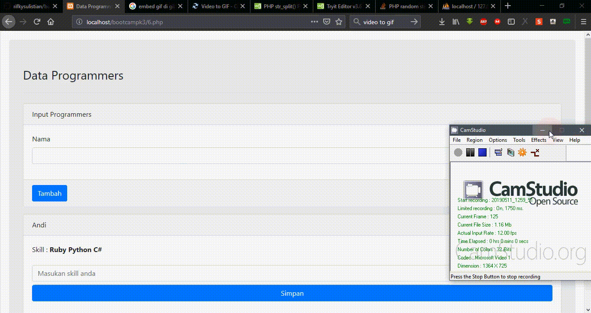

# Apa itu REST API?
Rest API adalah antarmuka program aplikasi yang menggunakan permintaan HTTP dengan metode GET, PUT, POST, PATCH, dan DELETE.

# Kegunan JSON pada REST API?
Kegunaan json pada RestAPI adalah untuk pertukaran informasi antar platform, formatnya mudah untuk dimengerti karena konsep nya mirip array

